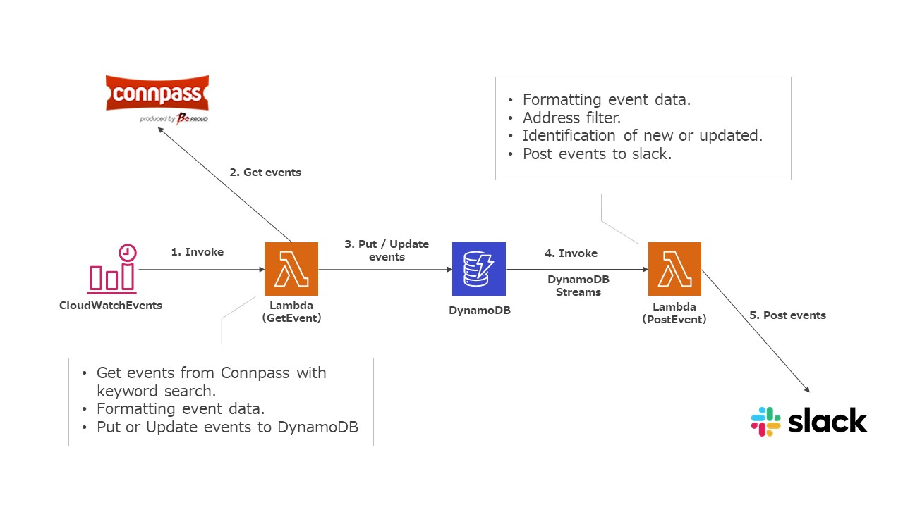

ConnpassToSlack
====

ConnpassToSlack is a tool to notify Connpass study session information to Slack.

## Description

ConnpassToSlack is a tool that notifies Slack of Connpass study session information.  
The study sessions notified by keywords, venues, etc. can be narrowed down to your preference.  
In addition, the program runs in an AWS serverless environment, and deployment of the execution environment is fully automated by terraform.

## Features

- Periodical execution by time specification. (Cron format)
- It is possible to narrow down the study sessions to be notified from the following options
  - Keywords (aws / meetup, etc., multiple OR selection is possible)
  - Venue (Tokyo / Kanagawa etc. Multiple OR can be selected)
  - Notification of update events. (whether or not to receive update information of the same event)
- Notify only the difference from the previous notification. (save notification information in Database)
- Can be deployed in minutes. (automatically deployed on AWS by running terraform)
- Low cost. (AWS usage is about several hundred yen per month)
  - Depending on the number of target events (study sessions) and the frequency of execution, there is a possibility that it will exceed about several hundred yen.
  - Based on current (2020/03) AWS pricing.

## Architecture



## Directory

```
.
├── README.md
├── doc                           # Architecture diagram
├── lambda_src_get_from_connpass  # source code (GetEvent)
├── lambda_src_send_to_slack      # source code (PostEvent)
└── terraform                     # terraform code
```

## Require

- terraform v0.12
- Your own AWS credentials

## Usage (deployment)

1. Repogitory download
   
   ```
   git clone https://github.com/ishim0226/ConnpassToSlack.git
   ```

2. Directory change
   
    ```
    cd ConnpassToSlack/terraform/
    ```

3. Parameter Setting
   
    ```
    vi variables.tf
    ```
    
    - variable "region"
      - => AWS region to deploy. (Ex. ap-northeast-1)
    - variable "app_name"
      - => This application name. (Anything is fine.)
    - variable "dynamodb_table_name"
      - => Dynamo table name. (Anything is fine.)
    - variable "triggerd_get_lambda"
      - => Invoke frequency of get event lambda. (Recommended once per hour or less, considering the load on Connpass.)
    - variable "get_lambda_environment"
      - CONNPASS_URL => Connpass API URL. (Ref:https://connpass.com/about/api/)
      - DYNAMO_TABLE => Same as dynamodb_table_name defined above.
      - KEYWORD => Keyword to search. (Separate with comma when multiple. Searched as OR.)
    - variable "send_lambda_environment"
      - CONNPASS_URL => Connpass API URL. (Ref:https://connpass.com/about/api/)
      - DYNAMO_TABLE => Same as dynamodb_table_name defined above.
      - ADDRESS_FILTER => Address to be notified. (Separate with comma when multiple. Searched as OR.)
      - WEBHOOK_URL => Slack webhook url. (Get to https://slack.com/services/new/incoming-webhook)

4. Initialize

    ```
    terraform init
    ```

5. Deploy

    ```
    terraform apply
    ```
